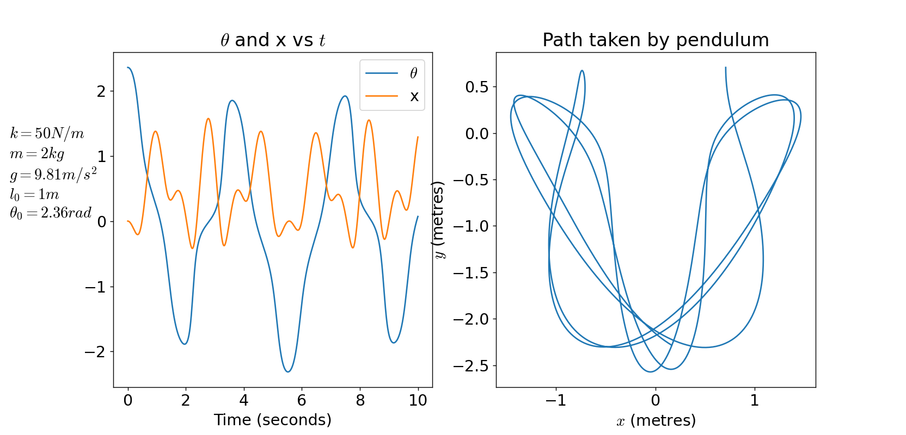
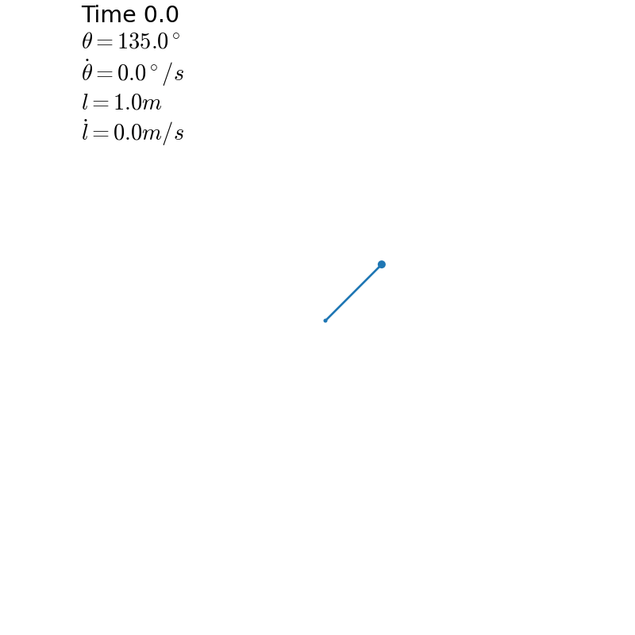
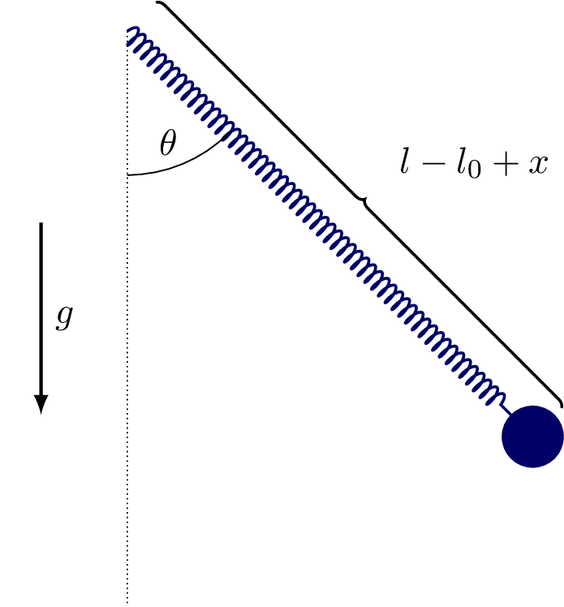

# Elastic Pendulum Simulator
This repository contains a simulator for the spring-pendulum system with two degrees of freedom ($\theta,x$) written in python with scipy's numerical integration and matplotlib's visualisation.

To find the position of the mass we use the following second-order ordinary differential equations:
$$\ddot{x}=(l_0+x)\dot{\theta}^2-\frac{k}{m}x+g\cos\theta$$
$$\ddot{\theta}=\frac{-g\sin\theta-2\dot{x}\dot{\theta}}{l_0+x}$$
These equations can then be fed into `scipy.integrate.solve_ivp` along with the starting conditions to solve the overall state over any time span.

## Installation
The only python requirements are `matplotlib` for visualisation, `scipy` for numeric integration, and `numpy` for general computations. All can be installed as follows:
```sh
pip install -r requirements.txt
```
The program also requires ```ffmpeg``` if you plan to create an animation, to turn the image frames into a gif or webp or mp4.
```sh
# MacOS
brew install ffmpeg
# Arch
sudo pacman -S ffmpeg
# ... Figure it out if your OS is not listed
```

## Usage
The software has two primary modes, `plot_stats` and `animate`. `plot_stats` will show a graph resembling the following:

`animate` will render frames to `frames/%04d.png` and then render them to an output file (`out.gif` by default) using `ffmpeg`. The gif will resemble the following:



To switch between these modes, simply scroll to the bottom of `simulator.py` and comment or uncomment either line.

The starting conditions of the system can be modified by editing `l0, k, m, g,` and `s0` in `simulator.py`. Additionally, some parameters regarding the simulation and rendering can be edited: `tmax, dt, fps`.

## Derivation
The above formulas can be derived using the [Euler-Lagrange Equation](https://en.wikipedia.org/wiki/Euler%25E2%2580%2593Lagrange_equation). Firstly, the system and variables must be defined: 



$\theta(t)$ is the angle of the pendulum from verticle, $x(t)$ is the distance the spring is stretched from equilibrium, $l$ is the total length of the spring ($l_0+x$ where $l_0$ is the equilibrium length), $g$ is the gravitational acceleration constant (set to $9.81ms^{-1}$), $m$ is the mass of the pendulum weight, and $k$ is the spring constant in $Nm^{-1}$ (See [Hooke's Law](https://en.wikipedia.org/wiki/Hooke%2527s_law)). Also, the vertical axis is defined as upwards while the horizontal axis is defined as towards the right.

Firstly, consider the Lagrangian function $L=T-V$ where $T$ is the kinetic energy of the system and $V$ is the potential energy of the system. $T$ is simply $\frac{1}{2}mv^2$, which can be written using $\theta$ and $x$ by combining the radial and tangential velocities with Pythagoras: $T=\frac{1}{2}m(\dot x^2+(l\dot\theta)^2)=\frac{1}{2}m(\dot x^2+(l_0+x)^2\dot\theta^2)$. The potential energy $V$ can be written as the combination of the spring's potential energy, given by Hooke's Law, and the gravitational potential energy: $V=V_g+V_k$. $V_g=-mgh$. $h$ can be found using simple right-angled trigonometry with $l$ and $\theta$, giving $V_g=-mgl\cos\theta=-mg(l_0+x)\cos\theta$. The spring's potential energy can be given as simply $\frac{1}{2}kx^2$, thus the Lagrangian function is given by
$$\begin{align*}L[\theta,\dot\theta,x,\dot x]&=\frac{1}{2}m(\dot x^2+(l_0+x)^2\dot\theta^2)+mg(l_0+x)\cos\theta-\frac{1}{2}kx^2\\
&=\frac{1}{2}m\dot x^2+\frac{1}{2}m(l_0+x)^2\dot\theta^2+mg(l_0+x)\cos\theta-\frac{1}{2}kx^2\quad(1)
\end{align*}$$

Now, we can apply the Euler-Lagrange function:
$$\begin{align*}
\frac{\partial L}{\partial x}&=\frac{d}{dt}\left(\frac{\partial L}{\partial \dot x}\right) \\
m(l_0+x)\dot\theta^2+mg\cos\theta-kx&=\frac{d}{dt}\left(m\dot x\right) \\
&=m\ddot x \\
\therefore \ddot x&=(l_0+x)\dot\theta^2+g\cos\theta-\frac{k}{m}x\quad (2)
\end{align*}$$
The same equation can be used with $\theta$ in place of $x$.
$$\begin{align*}
\frac{\partial L}{\partial\theta}&=\frac{d}{dt}\left(\frac{\partial L}{\partial\dot\theta}\right) \\
-mg(l_0+x)\sin\theta&=\frac{d}{dt}\left(m(l_0+x)^2\dot\theta\right) \\
&=2m(l_0+x)\dot x\dot\theta+m(l_0+x)^2\ddot\theta \\
\therefore \ddot\theta &=\frac{-g\sin\theta-2\dot x\dot\theta}{l_0+x}\quad (3)
\end{align*}$$